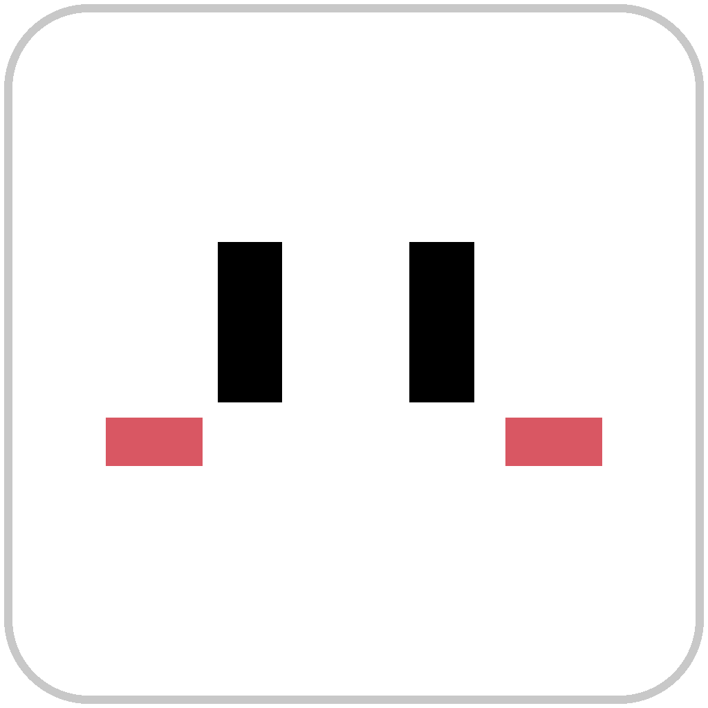
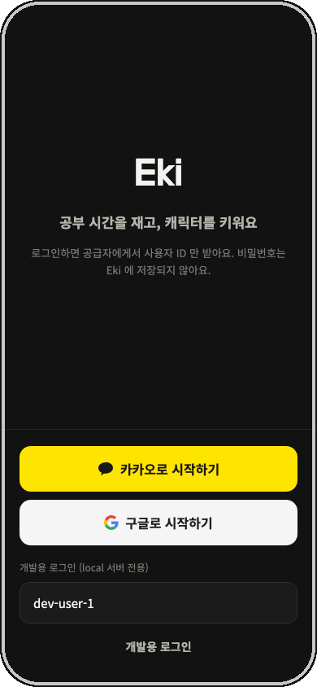
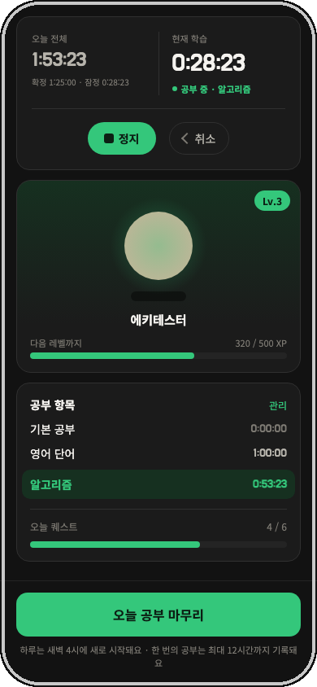
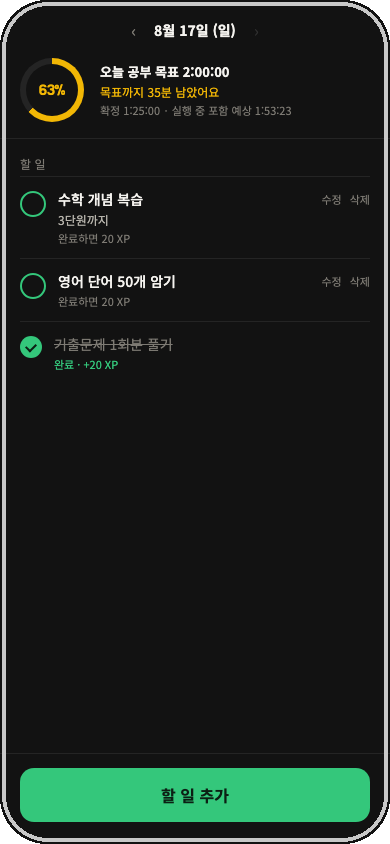
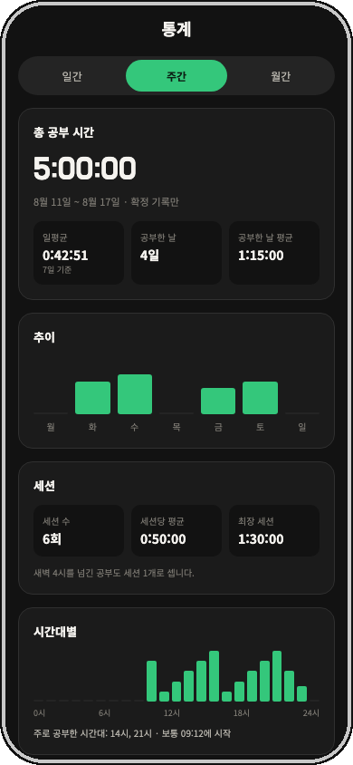
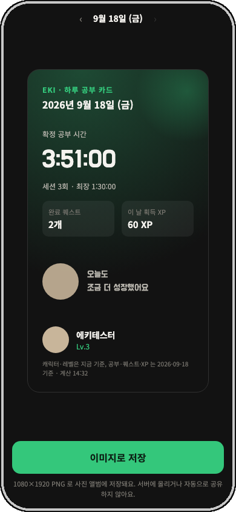
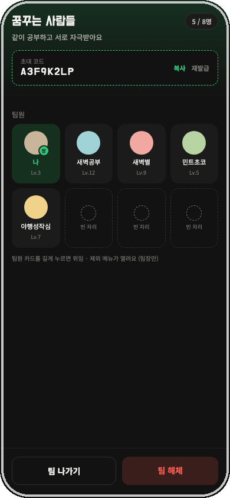

# Eki 에키

**공부 시간을 재고, 캐릭터를 키워요.**

---

### Eki가 뭔가요?

공부 시간을 재고 기록하면 내 캐릭터가 자라나는 스터디 타이머 앱이에요. 오늘 목표를 원형 게이지로 확인하고, 할 일을 완료해서 XP를 모으고, 팀을 만들어 친구들과 순위를 겨뤄요. 하루가 끝나면 그날의 기록을 카드 한 장으로 저장할 수 있어요.

> **이름 유래**: 팀 이름 **Ego 키우기**(ego-kiwoogi) — 공부하면서 나(자아)를 키운다는 뜻이에요. **Eki**는 그 줄임말입니다.

### 📲 지금 설치해보기 (Android)

**[eki-app 최신 빌드 다운로드 →](https://expo.dev/accounts/m0_0n/projects/eki-app/builds/b6a53969-e130-4707-8bd0-f4cb9ebc83b0)**

링크를 안드로이드 기기에서 열거나 QR을 스캔하면 바로 설치돼요 (Play 스토어 불필요, "출처를 알 수 없는 앱" 설치 허용 필요).

---

### 프로젝트

| 저장소 | 설명 |
| --- | --- |
| [**eki-app**](https://github.com/ego-kiwoogi/eki-app) | Expo / React Native 프론트엔드 |
| [**eki-server**](https://github.com/ego-kiwoogi/eki-server) | Spring Boot / PostgreSQL 백엔드 |

### 주요 기능

- ⏱️ **타이머** — 공부 항목별로 시간을 재고, 오늘 전체 기록을 확인해요
- 🎯 **퀘스트** — 오늘 공부 목표 달성률을 원형 게이지로, 할 일 완료로 XP 획득
- 🐣 **캐릭터 성장** — 모은 XP로 레벨업하고 캐릭터를 커스터마이징
- 🏆 **랭킹** — 전체/직군/팀 단위로 오늘·주간·월간 순위 경쟁
- 👥 **팀** — 초대 코드로 팀을 만들고 함께 공부해요
- 🃏 **공부 카드** — 하루 기록을 이미지 한 장으로 저장·공유

### 디자인

**다크 우선** 스터디 앱으로 설계했어요. 레퍼런스는 열품타지만 색은 그대로 쓰지 않고, Eki만의 **jade green**(`#34C77B`)을 브랜드 컬러로 잡았습니다. 시스템이 라이트 모드여도 앱은 항상 다크로 보여줘요.

화면별 시안은 Claude 디자인 캔버스로 짰고, 대부분 실제 앱에 반영됐어요.

<table>
<tr>
<td align="center" width="33%">
 로그인
</td>
<td align="center" width="33%">
 홈
</td>
<td align="center" width="33%">
 퀘스트
</td>
</tr>
<tr>
<td align="center" width="33%">
 통계
</td>
<td align="center" width="33%">
 공부 카드
</td>
<td align="center" width="33%">
 팀
</td>
</tr>
</table>

| 화면 | 상태 |
| --- | --- |
| 로그인 | ✅ 반영 |
| 홈 | ✅ 반영 |
| 퀘스트 (목표 원형 게이지) | ✅ 반영 |
| 랭킹 | ✅ 반영 |
| 통계 / 내정보 | ✅ 반영 |
| 팀 | ✅ 반영 |
| 공부 카드 | ✅ 반영 |
| 온보딩 | 🚧 진행 중 |

